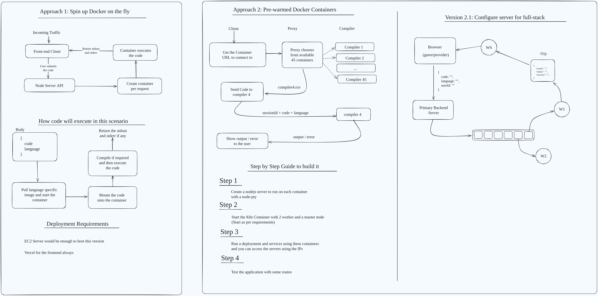

# System Design for Code Execution Server



## Table of Contents

- Overview
- Approach 1: Spin up Docker on the Fly
- Approach 2: Pre-warmed Docker Containers
  - Version 2.1: Full-Stack Code Execution Server
- Deployment Requirements
- Step-by-Step Guide for Implementation

## Overview

This system design proposes three solutions for handling code execution on a backend server. The primary goal is to handle requests from users submitting code in different programming languages, execute the code, and return the output or errors, all while ensuring efficient resource management.

## Approach 1: Spin up Docker on the Fly

### Description

In this approach, a Docker container is created dynamically for each incoming code execution request. This ensures that each request is isolated in its environment.

### Workflow

1. The front-end client sends code to the Node.js server.
2. The Node.js server creates a Docker container for each request.
3. The Docker container pulls the appropriate language-specific image, mounts the submitted code, and executes it.
4. The output (or errors) is returned to the Node.js server and then back to the client.

### How the Code Executes:

**Request Body:**

```json
{
  "code": "print('Hello World!')",
  "language": "python"
}
```

- The system pulls a language-specific Docker image based on the `"language"` field and executes the code inside a new container.
- The container is mounted with the submitted code, compiled if necessary, and executed.
- The `stdout` and `stderr` are captured and returned to the client.

### Pros:

- Complete isolation for each code execution.
- Flexibility in supporting multiple languages.

### Cons:

- Time and resource overhead in creating a container for every request.

---

## Approach 2: Pre-warmed Docker Containers

### Description

This approach uses a pool of pre-warmed Docker containers to handle incoming requests more efficiently by eliminating the need to spin up a new container for each request.

### Workflow

1. A proxy manages a pool of 45 pre-warmed containers, each capable of compiling and executing code.
2. When a code execution request arrives, the proxy routes the request to one of the pre-warmed containers.
3. The chosen container compiles and executes the submitted code and returns the output or errors to the client.

### How the Code Executes:

**Request Body:**

```json
{
  "code": "<submitted_code>",
  "language": "<code_language>"
}
```

- The proxy selects an available container from the pool.
- The container runs the code and returns the result to the client.
- The result may include `stdout`, `stderr`, or any compilation errors.

### Pros:

- Faster execution compared to spinning up containers on demand.
- Efficient use of resources with pre-warmed containers.

### Cons:

- Pre-warmed containers can still become a bottleneck if all are in use.

---

## Version 2.1: Full-Stack Code Execution Server

### Description

This version is designed to handle full-stack scenarios, including integrating WebSockets to support real-time updates for code execution results and a queue system for processing requests.

### Workflow

1. The client sends code, language, and user information to the primary backend server.
2. The backend server communicates with WebSocket services (WS) and a queue system (W1, W2) to handle code execution requests.
3. The result of the execution (`stdout`, `stderr`, etc.) is returned to the user in real time via WebSockets.

### How the Code Executes:

**Request Body:**

```json
{
  "code": "<submitted_code>",
  "language": "<code_language>",
  "userId": "<user_id>"
}
```

- The code is placed in a queue, where multiple worker nodes (W1, W2) can process the request in parallel.
- The WebSocket service provides real-time feedback on the execution status and final result.

### Pros:
- Scalable to support multiple requests simultaneously.
- Real-time feedback via WebSockets enhances user experience.

### Cons:
- Requires more infrastructure, such as queue management and WebSocket services.
